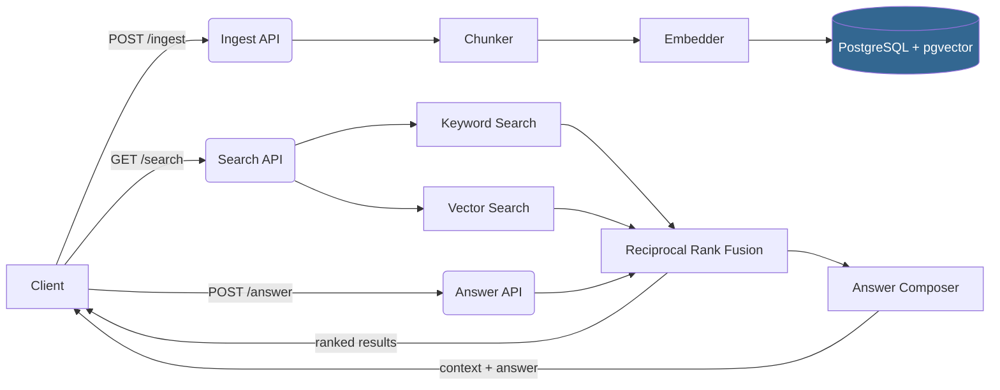

# ax-rag-starter

**End-to-end Retrieval-Augmented Generation (RAG) starter kit** — ingest documents, chunk and embed them, store in PostgreSQL + pgvector, and retrieve answers through a FastAPI service.

Built and maintained by **[Axelliant Software Engineering](https://axelliant.com)**.

[](https://github.com/axelliant/ax-rag-starter/actions/workflows/ci.yml)
[](LICENSE)

---

## Why This Exists

Most RAG tutorials stop at "call the OpenAI API." Real production systems need chunking strategies, hybrid retrieval, structured storage, observability, and the ability to run **entirely offline** for development. `ax-rag-starter` gives you a working end-to-end pipeline you can run with a single `docker compose up` — no API keys required.

## Features

- **Full pipeline**: Ingest → Chunk → Embed → Store → Retrieve → Answer
- **Local-first**: Runs without external APIs using a deterministic hash embedder
- **Hybrid retrieval**: Combines keyword search (SQL ILIKE) and vector similarity (pgvector cosine) via Reciprocal Rank Fusion
- **PostgreSQL + pgvector**: Battle-tested storage with vector indexing in a single database
- **Structured logging**: Request tracing with trace-id propagation via `structlog`
- **Docker-ready**: One command to spin up API + database
- **Extensible**: Swap the stub embedder for OpenAI, Cohere, or any provider by implementing the `Embedder` protocol

## Architecture



### Component Overview

| Component | Description |
|-----------|-------------|
| **FastAPI service** | Three endpoints: `/ingest`, `/search`, `/answer` plus `/health` |
| **Chunker** | Configurable fixed-size chunking with overlap and sentence-boundary detection |
| **Embedder** | Pluggable interface; ships with a deterministic hash stub |
| **Storage** | PostgreSQL with pgvector extension for combined relational + vector storage |
| **Retrieval** | Hybrid keyword + vector search fused with Reciprocal Rank Fusion (RRF) |
| **Observability** | Structured JSON logging, trace-id on every request, OpenTelemetry stubs |

## Quickstart

### Prerequisites

- [Docker](https://docs.docker.com/get-docker/) and Docker Compose
- Python 3.11+ (for local development)

### Run with Docker (recommended)

```bash
# Clone the repository
git clone https://github.com/axelliant/ax-rag-starter.git
cd ax-rag-starter

# Copy environment config
cp .env.example .env

# Start API + PostgreSQL
docker compose up -d --build

# Load sample documents
pip install httpx  # one-time dependency for the script
python scripts/load_samples.py

# Try a search
curl 'http://localhost:8000/search?q=vector+database'

# Ask a question
curl -X POST http://localhost:8000/answer \
  -H 'Content-Type: application/json' \
  -d '{"question": "What is hybrid retrieval?"}'
```

### Run locally (development)

```bash
# Set up virtualenv + install deps
make setup
source .venv/bin/activate

# Start PostgreSQL only
docker compose up -d postgres

# Copy config
cp .env.example .env

# Run the API with hot-reload
make run
```

## Configuration

All settings are loaded from environment variables (or `.env` file). See [`.env.example`](.env.example) for the full list.

| Variable | Default | Description |
|----------|---------|-------------|
| `POSTGRES_HOST` | `localhost` | PostgreSQL hostname |
| `POSTGRES_PORT` | `5432` | PostgreSQL port |
| `POSTGRES_USER` | `axrag` | Database user |
| `POSTGRES_PASSWORD` | `changeme` | Database password |
| `POSTGRES_DB` | `axrag` | Database name |
| `API_HOST` | `0.0.0.0` | API bind address |
| `API_PORT` | `8000` | API port |
| `LOG_LEVEL` | `info` | Logging level |
| `LOG_FORMAT` | `console` | `console` for dev, `json` for production |
| `EMBEDDING_DIM` | `384` | Embedding vector dimension |
| `CHUNK_SIZE` | `512` | Maximum characters per chunk |
| `CHUNK_OVERLAP` | `64` | Overlap between consecutive chunks |

## API Usage

### `POST /ingest` — Ingest text

```bash
curl -X POST http://localhost:8000/ingest \
  -H 'Content-Type: application/json' \
  -d '{"text": "Your document text here...", "source": "my-doc"}'
```

Response:
```json
{
  "document_id": "a1b2c3d4",
  "chunks_created": 3,
  "message": "Ingested 3 chunks from source 'my-doc'"
}
```

### `POST /ingest/file` — Ingest a file

```bash
curl -X POST http://localhost:8000/ingest/file \
  -F 'file=@document.txt'
```

### `GET /search?q=` — Hybrid search

```bash
curl 'http://localhost:8000/search?q=retrieval+augmented+generation&top_k=5'
```

Response:
```json
{
  "query": "retrieval augmented generation",
  "results": [
    {
      "chunk_id": "abc123",
      "text": "Retrieval-Augmented Generation (RAG) combines...",
      "score": 0.032787,
      "source": "sample/rag-overview",
      "created_at": "2025-02-13T12:00:00Z"
    }
  ],
  "count": 1
}
```

### `POST /answer` — Question answering

```bash
curl -X POST http://localhost:8000/answer \
  -H 'Content-Type: application/json' \
  -d '{"question": "How does hybrid retrieval work?", "top_k": 3}'
```

### `GET /health` — Health check

```bash
curl http://localhost:8000/health
# {"status": "ok"}
```

Interactive API docs are available at **http://localhost:8000/docs** (Swagger UI).

## Scripts

| Script | Description |
|--------|-------------|
| `python scripts/load_samples.py` | Load 4 sample documents into the running API |
| `python scripts/reindex.py` | Re-embed all stored chunks (run after changing embedder) |

## Examples

### Ingest a local file and search

```bash
# Ingest
curl -X POST http://localhost:8000/ingest/file -F 'file=@README.md'

# Search
curl 'http://localhost:8000/search?q=quickstart'

# Get an answer
curl -X POST http://localhost:8000/answer \
  -H 'Content-Type: application/json' \
  -d '{"question": "How do I get started?"}'
```

### Swap in a real embedder

Implement the `Embedder` protocol in `src/ax_rag/embedding/`:

```python
class OpenAIEmbedder:
    @property
    def dim(self) -> int:
        return 1536

    def embed(self, text: str) -> list[float]:
        # Call OpenAI API here
        ...

    def embed_batch(self, texts: list[str]) -> list[list[float]]:
        ...
```

Then update the factory in `src/ax_rag/embedding/stub.py`:

```python
def get_embedder() -> Embedder:
    return OpenAIEmbedder()
```

## Testing

```bash
# Run all tests
make test

# Run with coverage
make test-cov

# Run a specific test file
pytest tests/test_chunker.py -v
```

The test suite includes:
- **Unit tests**: chunker logic, embedding determinism, RRF scoring
- **API smoke tests**: endpoint validation and error handling

## Deployment

### Docker Compose (recommended for staging)

```bash
cp .env.example .env
# Edit .env with production values (strong passwords, json logging, etc.)
docker compose up -d --build
```

### Production Considerations

- Place the API behind a reverse proxy (nginx, Caddy) with TLS termination
- Set `LOG_FORMAT=json` for structured log aggregation
- Use a managed PostgreSQL instance with pgvector support for production workloads
- Set strong, unique values for `POSTGRES_PASSWORD`
- Consider adding rate limiting at the proxy layer
- Enable OpenTelemetry by installing the `otel` extras: `pip install -e ".[otel]"`

## Security Notes

- **No secrets in the repository.** All sensitive values are loaded from environment variables.
- The stub embedder is deterministic and does not call external services.
- File upload is limited to text files. Validate and sanitise uploads in production.
- Database credentials should be rotated regularly.
- See [SECURITY.md](SECURITY.md) for vulnerability reporting.
- Security contact: [security@axelliant.com](mailto:security@axelliant.com)

## Roadmap

- [ ] Pluggable embedding providers (OpenAI, Cohere, local sentence-transformers)
- [ ] PDF and markdown ingestion with format-aware chunking
- [ ] BM25 scoring via `pg_bm25` or `tsvector` for improved keyword retrieval
- [ ] LLM-powered answer synthesis with streaming responses
- [ ] Authentication and API key management
- [ ] Async batch ingestion with background workers
- [ ] OpenTelemetry traces and metrics dashboard
- [ ] Helm chart for Kubernetes deployment

## Contributing

We welcome contributions! Please read [CONTRIBUTING.md](CONTRIBUTING.md) before submitting a pull request.

## License

This project is licensed under the [Apache License 2.0](LICENSE).

---

Built by **[Axelliant Software Engineering](https://axelliant.com)** | [info@axelliant.com](mailto:info@axelliant.com) | [security@axelliant.com](mailto:security@axelliant.com)
